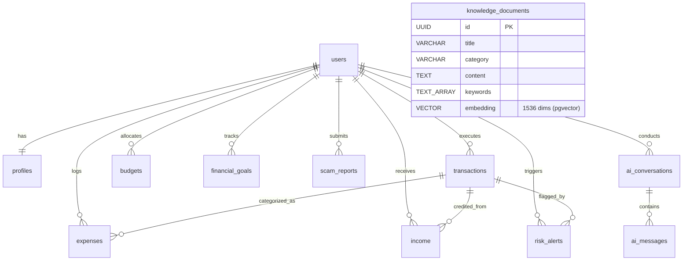

# 🗄️ Supabase PostgreSQL + pgvector Database Schema (Phase 2)

## 1. Overview
The database layer is engineered for **Supabase**, leveraging:
- **PostgreSQL 15+** with relational integrity, cascading deletes, and JSONB document storage.
- **pgvector extension** for high-dimensional semantic search across verified scam knowledge bases.
- **Row Level Security (RLS)** ensuring multi-tenant data isolation.
- **HNSW Indexing** for fast nearest-neighbor vector retrieval.

---

## 2. Entity-Relationship Diagram (ERD)



---

## 3. The 12 Core Tables

| Table | Purpose | Key Attributes |
| :--- | :--- | :--- |
| `users` | Identity and credentials | `id (UUID)`, `email`, `role`, `is_active` |
| `profiles` | Financial risk tolerance & security score | `user_id`, `monthly_income`, `risk_appetite`, `security_score` |
| `transactions` | Ledger stream with real-time risk scores | `amount`, `type`, `merchant`, `risk_score`, `is_anomaly`, `risk_flags` |
| `expenses` | Categorized spending breakdown | `category`, `amount`, `payment_method`, `recurring`, `expense_date` |
| `income` | Inflow tracking & verification | `source`, `amount`, `frequency`, `is_verified` |
| `budgets` | Spending limits with warning thresholds | `category`, `budgeted_amount`, `period`, `alert_threshold_percentage` |
| `financial_goals`| Targets (Emergency reserves, savings) | `title`, `target_amount`, `current_amount`, `status` |
| `risk_alerts` | Machine learning anomaly notifications | `transaction_id`, `severity`, `title`, `indicators (JSONB)` |
| `scam_reports` | Social engineering threat incident logs | `channel`, `raw_content`, `threat_level`, `risk_score` |
| `ai_conversations`| Chat sessions with the AI Guardian | `user_id`, `title`, `session_context (JSONB)` |
| `ai_messages` | Prompts, responses & RAG citations | `conversation_id`, `sender_role`, `content`, `rag_citations` |
| `knowledge_documents`| Semantic fraud vector store | `content`, `embedding vector(1536)`, `official_helpline` |

---

## 4. pgvector Semantic Similarity Search

Semantic similarity uses cosine distance (`<=>` operator) with HNSW acceleration:

```sql
SELECT 
    id, 
    title, 
    category, 
    content, 
    1 - (embedding <=> query_embedding) AS similarity
FROM public.knowledge_documents
WHERE is_active = TRUE
ORDER BY embedding <=> query_embedding
LIMIT 3;
```

---

## 5. Deployment Guide: Connecting to Supabase

1. Create a free project at [https://supabase.com](https://supabase.com).
2. Open the **SQL Editor** in your Supabase dashboard.
3. Paste and run [backend/supabase/migrations/20261001000000_phase2_initial_schema.sql](file:///c:/Projects/Defeat%20Scammer/backend/supabase/migrations/20261001000000_phase2_initial_schema.sql).
4. Run [backend/supabase/seed.sql](file:///c:/Projects/Defeat%20Scammer/backend/supabase/seed.sql) to inject the baseline test data.
5. In **Project Settings -> API**, copy:
   - `Project URL`
   - `anon public key`
   - `service_role secret key`
6. Add these to `backend/.env` and `frontend/.env.local`:
   ```env
   SUPABASE_URL=https://[YOUR-PROJECT-REF].supabase.co
   SUPABASE_KEY=[YOUR-ANON-KEY]
   ```
